## 개요

클라우드포레에서 AWS [서비스 계정](https://spaceone.org/ko/docs/guides/getting-started/#%EC%84%9C%EB%B9%84%EC%8A%A4-%EA%B3%84%EC%A0%95-%EC%84%A4%EC%A0%95)을 등록하기 위해서 아래와 같은 설정 정보가 필요합니다.
- **[Account ID]**
- **[AWS Access Key ID]** 
- **[AWS Secret Key]**
- **[Role ARN] (선택)**

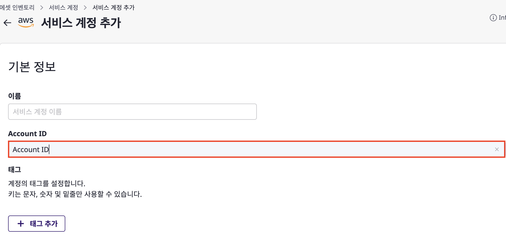

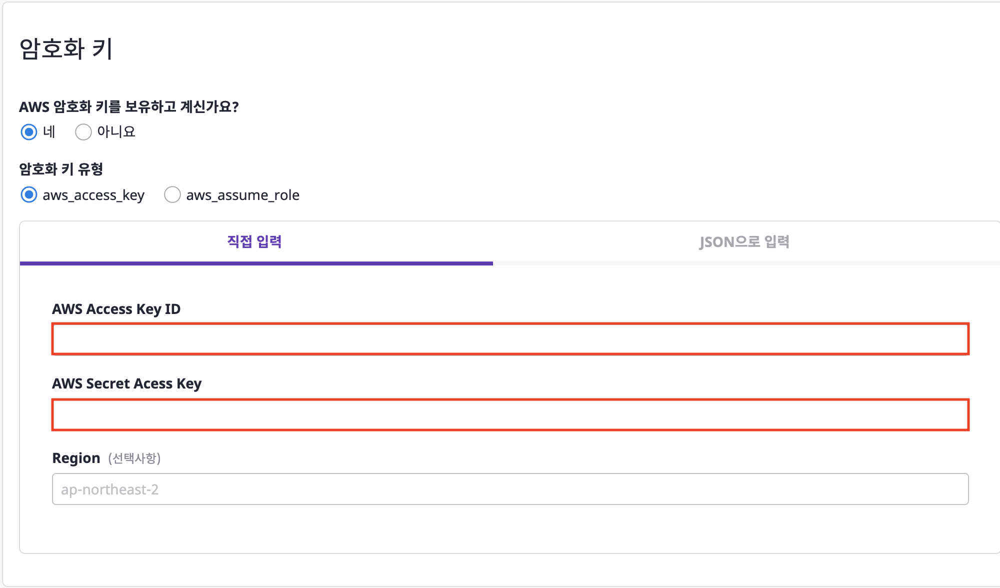

본 설정 가이드는 위에서 언급한 4가지 설정 정보들이 무엇을 의미하고, 어디서 획득하는지 자세히 알아보도록 하겠습니다.

 

### Account ID

계정 생성과 함께 발급되는 12개의 숫자로 이루어진 AWS 계정의 고유 ID입니다.  
**Account ID**에 대한 상세한 설명은 [AWS Documentation](https://docs.aws.amazon.com/general/latest/gr/acct-identifiers.html)을 참고하십시오.

 

### **AWS Access Key ID**와 **AWS Secret Key**

IAM 계정 생성 시 AWS API, CLI, SDK 및 기타 개발 도구에 대한 접근 권한을 얻기 위해 필요한 키값입니다.  
AWS Access Key ID와 AWS Secret Key에 대한 상세한 설명은 [AWS Documentation](https://docs.aws.amazon.com/powershell/latest/userguide/pstools-appendix-sign-up.html#get-access-keys)을 참고하십시오.

 

### **Role ARN** (Amazone Resource Name)

ARN은 AWS 리소스를 구분하기 위한 식별자입니다. 
**[Role ARN]** 은 아래에서 생성하게 될 역할(Role)에 대한 식별자를 의미하며 **[aws_assume_role]** 방식을 활용한 서비스 계정 등록 시 필요한 **[Role ARN]** 설정 정보를 제공합니다. 
ARN에 대한 자세한 설명은 [AWS Documentation](https://docs.aws.amazon.com/general/latest/gr/aws-arns-and-namespaces.html)을 참고하십시오.

4가지 개념에 대해 간략히 알아보았습니다.  
이제, 실제로 **설정 정보를 획득하는 방법에 대해** 다음 과정에서 자세히 알아보도록 하겠습니다.

 
 

## ****전체 Flow****
클라우드포레에서는 AWS 연동에 대해 **[aws_access_key]** 방식과 **[aws_assume_role]** 총 두 가지 방식을 지원합니다.

**[aws_access_key]** 를 이용한 방식은 **[Account ID]**, **[AWS Access Key ID]** 그리고 **[AWS Secret Key]** 에 대한 설정 정보가 필요하며, 
**[aws_assume_role]** 방식을 이용할 경우, 위 정보 이외에 추가적으로 역할(Role)을 생성하여 **[Role ARN]** 설정 정보를 획득해야 합니다.

 위 정보를 획득하기 위해 아래와 같은 순서로 설정을 진행해야 합니다.

1. [정책(Policy) 생성](#1-정책Policy-생성)
2. [IAM 사용자 생성](#2-IAM-사용자-생성)
3. [그룹(Group) 생성](#3-그룹Group-생성)
4. [역할(Role) 생성(선택)](#4-역할Role-생성선택)
5. [서비스 계정 등록](#5-서비스-계정-등록)

 
 

## 1. 정책(Policy) 생성

[정책](https://docs.aws.amazon.com/ko_kr/mediaconvert/latest/ug/auth_access_what-are-policies.html)은 자격증명이나 AWS리소스에 대한 접근 권한을 정의합니다. 
생성된 정책은 IAM 사용자, 그룹, 역할에 적용될 수 있습니다. 

클라우드포레는 AWS의 리소스 정보를 수집하기 위해 적절한 권한을 설정하여 정책(Policy)으로 만들어 사용하는 것을 권장합니다.  
컬렉터 플러그인은 읽기 권한 이외의 어떠한 권한도 필요하지 않습니다.

각 Plugin에서 필요로 하는 권한에 대한 정보는 아래와 같습니다.

|Plugin                            | URL                                                                                              |
|----------------------------------|--------------------------------------------------------------------------------------------------|
| AWS Cloud Services collector     | https://github.com/spaceone-dev/plugin-aws-cloud-service-inven-collector#authentication-overview |
| AWS EC2 Compute collector        | https://github.com/spaceone-dev/plugin-aws-ec2-inven-collector#authentication-overview           |
| AWS Personal Health Dashboard collector | https://github.com/spaceone-dev/plugin-aws-phd-inven-collector#authen                            |
| AWS Trusted Advisor collector    | https://github.com/spaceone-dev/plugin-aws-phd-inven-collector#authentication-overview           |

 
 

인벤토리 컬렉터가 실행되는데 필요한 권한에 대한 정책 생성 방법은 아래와 같습니다.

(1) [AWS 콘솔](https://signin.aws.amazon.com/signin?redirect_uri=https%3A%2F%2Fconsole.aws.amazon.com%2Fconsole%2Fhome%3FhashArgs%3D%2523%26isauthcode%3Dtrue%26nc2%3Dh_ct%26src%3Dheader-signin%26state%3DhashArgsFromTB_us-west-1_170054870035abe3&client_id=arn%3Aaws%3Asignin%3A%3A%3Aconsole%2Fcanvas&forceMobileApp=0&code_challenge=50EZtidRQYVM_RvQ0yHgj2KQjR311eLzH3684mE0Tlk&code_challenge_method=SHA-256) 로그인 > [IAM 대시보드](https://us-east-1.console.aws.amazon.com/iamv2/home#/home) 이동 

(1-2) 대시보드의 [액세스 관리 > 정책] 메뉴에서 정책을 생성할 수 있습니다.

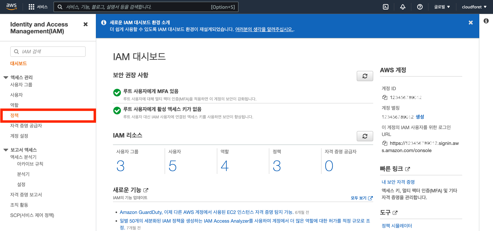

(2) 정책 생성을 위해 [정책 생성] 버튼을 클릭합니다.

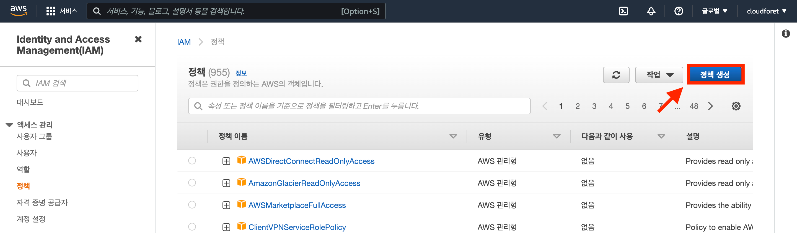

(2-1) 해당 정책에 대한 권한을 부여하기 위해 [JSON] 탭을 클릭합니다.  

(2-2) 컬렉터 플러그인은 서비스 데이터를 수집하기 위한 특정 권한이 있어야 합니다. [권한 목록](https://github.com/spaceone-dev/plugin-aws-phd-inven-collector#authentication-overview)을 복사 후 [다음:태그] 버튼을 클릭합니다.

> 💡 **권한 정의 오류 발생 시**  
        _이 정책에 다음 오류가 포함되어 있습니다. JSON strings must not have leading spaces_  
        _For more information about the IAM policy grammar, see [AWS IAM Policies](http://docs.aws.amazon.com/IAM/latest/UserGuide/policies-grammar.html)_  
       위와 같은 오류 발생 시 코드 블록의 첫 번째 줄 공백을 삭제하십시오.

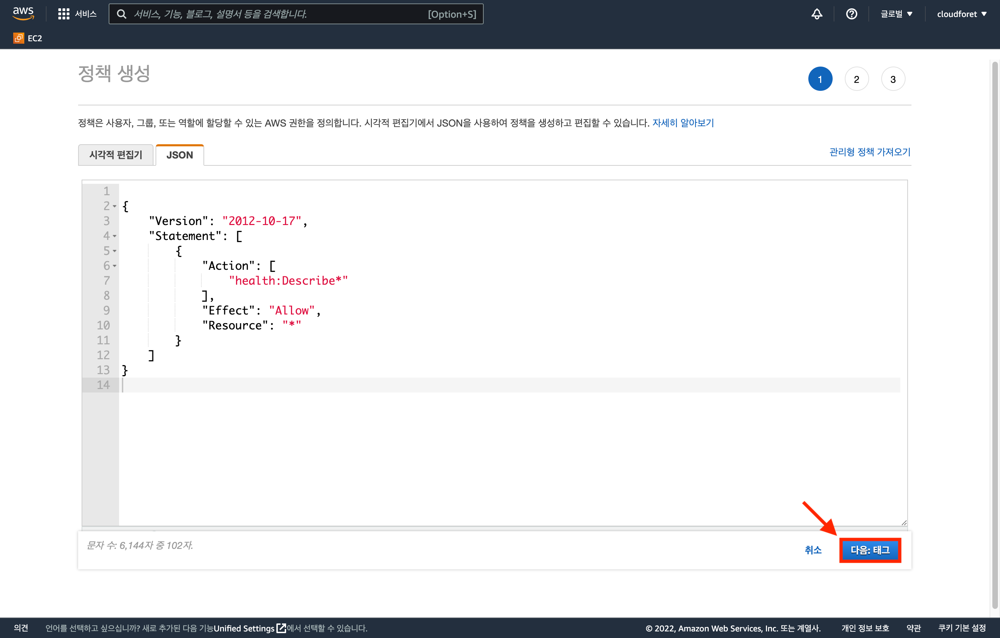

(3) 별도 태그 기반 관리 방침이 없는 경우 [다음: 검토] 버튼을 클릭합니다.

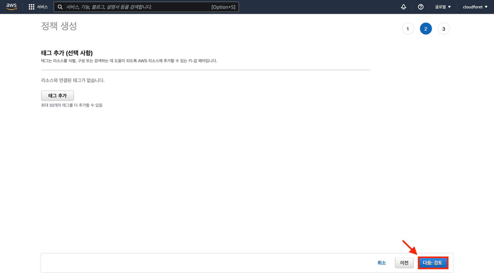

(4) 정책 이름을 입력 후 [정책 생성] 버튼을 클릭하여 정책 생성을 완료합니다.

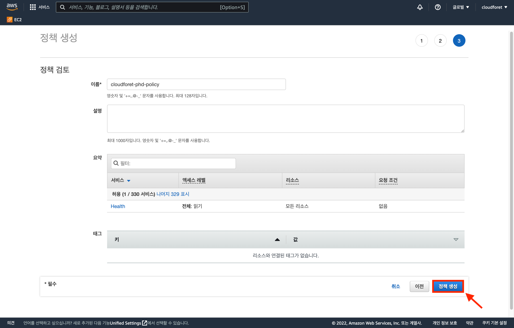

 
 

## 2. IAM 사용자 생성

 [IAM](https://docs.aws.amazon.com/ko_kr/IAM/latest/UserGuide/introduction.html) 사용자는 AWS 리소스에 대한 액세스를 안전하게 제어하기 위해 생성합니다. 
생성된 IAM 사용자를 다음 단계에서 그룹에 추가합니다.
이 과정을 통해 **[AWS Access Key ID]** 와 **[AWS Secret Key]** 값을 얻을 수 있습니다.

(1) [IAM 대시보드](https://us-east-1.console.aws.amazon.com/iamv2/home#/home)로 이동

(1-1) 대시보드에서 [액세스 관리 > 사용자] 메뉴에서 사용자를 생성할 수 있습니다.
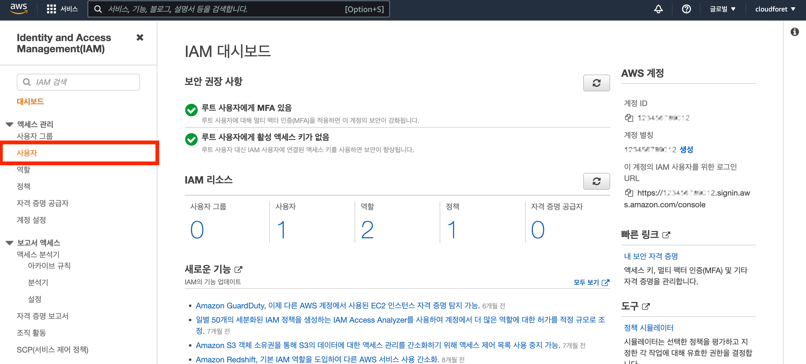

(2)[사용자 추가] 버튼을 클릭합니다.

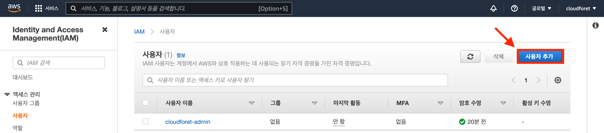

(3) 사용자 이름을 입력한 후 AWS 액세스 유형 선택에서 [액세스키 - 프로그래밍 방식 액세스]를 선택합니다.

(3-1) [다음: 권한] 버튼을 클릭합니다.

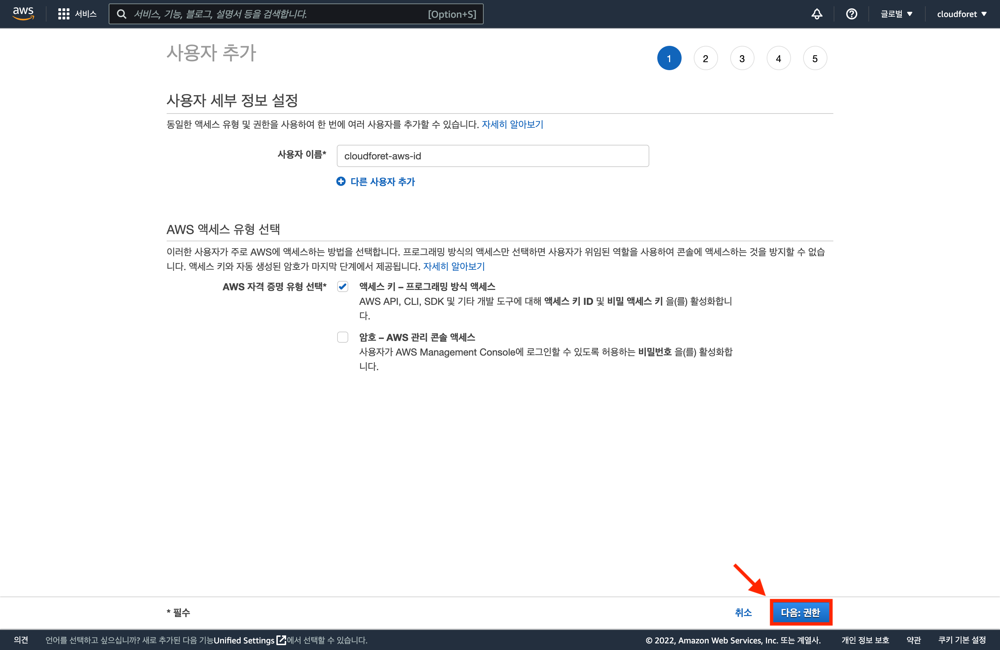

(4) 현재 단계에서 그룹에 사용자를 추가하지 않습니다. [다음: 태그] 버튼을 클릭합니다.

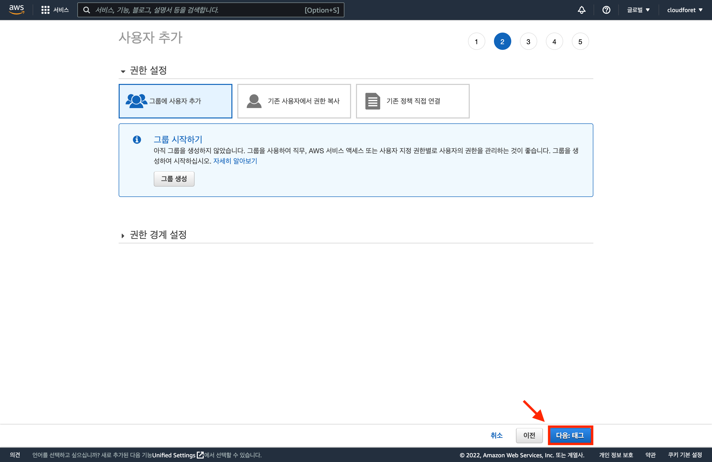

(5) 별도 Tag 기반 관리 방침이 없는 경우 생략 후 [다음: 태그] 버튼을 클릭합니다.  
      클라우드포레 컬렉터 플러그인은 태그 정보를 사용하지 않습니다.

(6) 현재 단계에서 IAM 사용자에게 권한 설정을 하지 않습니다.  
     [그룹 생성](https://www.notion.so/AWS-00c4b41daeb4478890495527b56069af) 단계에서 그룹에 정책을 추가하여 사용자에게 권한을 부여하게 됩니다.   
     [사용자 만들기] 버튼을 클릭합니다.

(7) 서비스 계정 등록 시 필요한 **[AWS Access Key ID]** 와 **[AWS Secret Key]** 의 해당하는 설정 정보인 [액세스 키 ID] 와 [비밀 액세스 키]가 생성됩니다.  
이후 페이지 이동 시 해당 정보들을 확인할 수 없으니 **메모**해주십시오.

(7-1) [닫기] 버튼을 눌러 사용자 추가를 완료합니다.

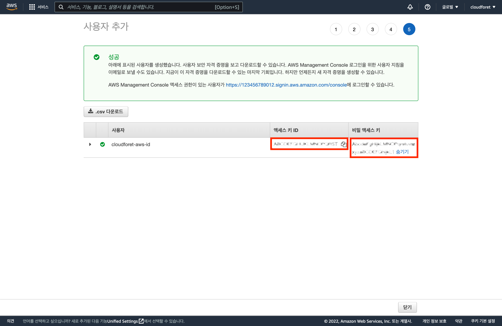

 
 

## 3. 그룹(Group) 생성

[그룹](https://docs.aws.amazon.com/ko_kr/IAM/latest/UserGuide/id_groups.html)은 IAM 사용자의 집합입니다. 
그룹을 통해 사용자들에 대한 권한을 지정하여 해당 사용자들에 대한 권한을 더욱 쉽게 관리할 수 있습니다.

(1) [IAM 대시보드](https://us-east-1.console.aws.amazon.com/iamv2/home#/home)로 이동

(1-1) 대시보드에서 [액세스 관리 > 사용자 그룹] 메뉴에서 사용자 그룹을 생성할 수 있습니다.

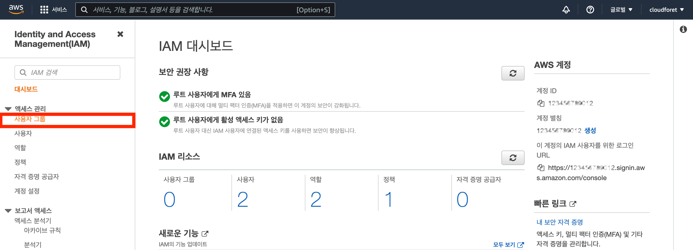

(2) [그룹 생성] 버튼을 클릭합니다.

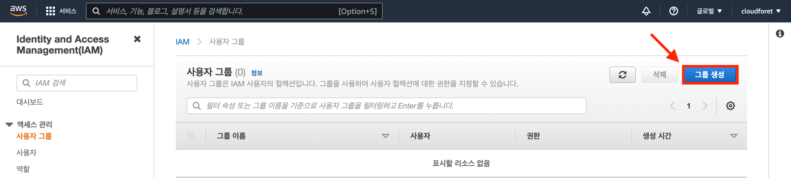

(3) 그룹에 사용자 추가에 추가할 사용자를 선택합니다.

(3-1) 권한 정책 연결에서 그룹에 추가할 정책을 선택합니다.

(3-2) [그룹 생성] 버튼을 클릭합니다.

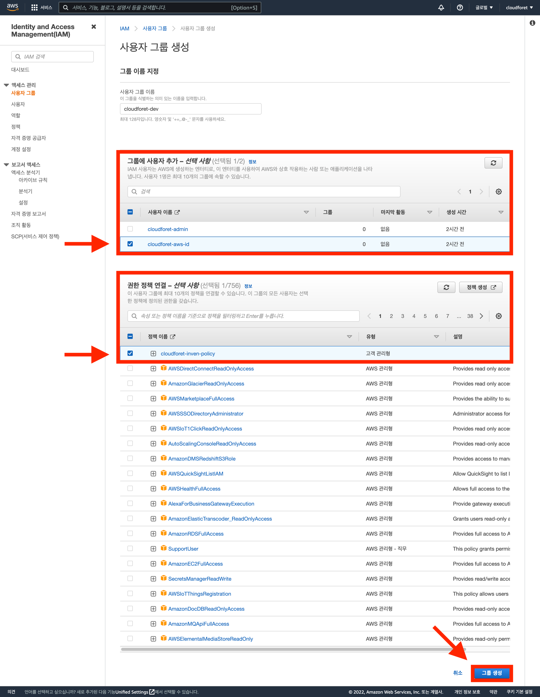

 
 

## 4. 역할(Role) 생성(선택)

[역할](https://docs.aws.amazon.com/IAM/latest/UserGuide/id_roles.html)은 계정에 생성할 수 있는, 특정 권한을 지닌 IAM 자격 증명을 의미하며 [**[Assume Role]**](https://docs.aws.amazon.com/ko_kr/STS/latest/APIReference/API_AssumeRole.html)은 자신의 계정 혹은 다른 계정에 클라우드 리소스 액세스 권한을 부여하기 위해 사용됩니다.
 

> 다음은 [Assume Role] 활용 예시입니다.   
_각각의 AWS 계정에 IAM 사용자 [A], [B], [C] 가 있고 역할을 위임받을 IAM사용자 [D] 가 있다고 가정하겠습니다.  
[A], [B], [C] 각각의 IAM 사용자별로 클라우드 리소스 수집을 위한 권한이 있는 역할을 [D] 계정으로 위임하여 생성합니다.
총 3개의 [Role ARN]이 생성되게 됩니다.  
최종적으로 정책을 위임받은 [D] IAM 사용자의  [AWS Access Key ID], [AWS Secret Key] 와 [A], [B], [C] IAM 사용자의 [Role ARN] 을 통해 사용 중인 클라우드 리소스를 수집할 수 있게 됩니다._
  

AWS 서비스 계정 등록 시 **[aws_assume_role]** 방식에 필요한 **[Role ARN]** 설정 정보를 얻을 수 있습니다.  
**[aws_access_key]** 방식을 진행 중이라면 이 과정을 생략하시고 [서비스 계정 등록](#5-서비스-계정-등록)으로 이동하십시오.  

(1) [IAM 대시보드](https://us-east-1.console.aws.amazon.com/iamv2/home#/home)로 이동

(1-1) 대시보드에서 [액세스 관리 > 역할] 메뉴에서 역할을 생성할 수 있습니다.

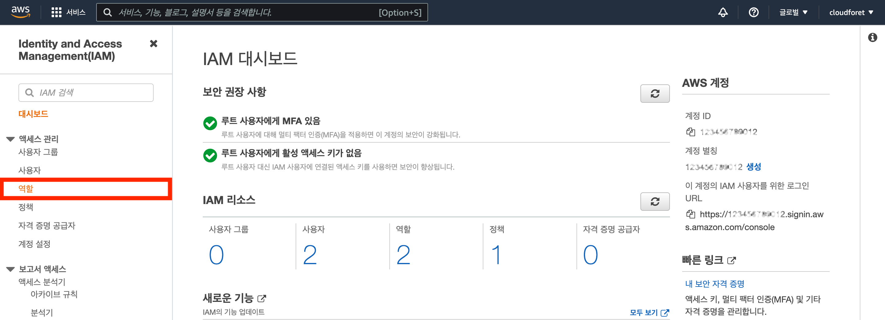

(2) [역할 만들기] 버튼을 클릭합니다.

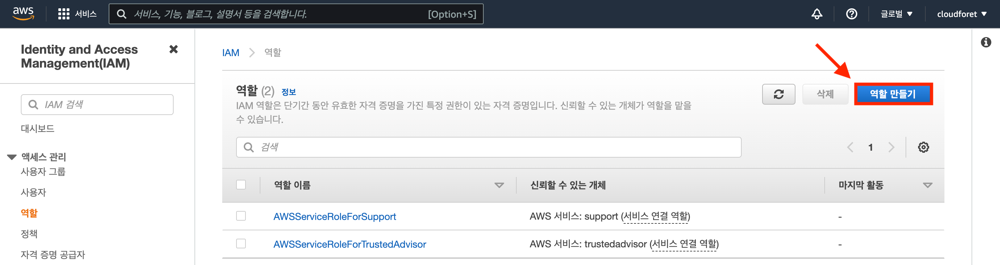

(3) 신뢰할 수 있는 엔터티 유형으로 [AWS 계정]을 클릭합니다.

(3-1) [다음] 버튼을 클릭합니다.

(3-2) 역할을 부여할 AWS계정을 선택할 수 있습니다.

[이 계정]을 선택할 경우 자신의 계정이 사용하고 있는 클라우드 리소스에 대한 권한을 부여하게 됩니다.

[다른 AWS 계정]을 선택할 경우 역할을 부여한 계정이 자신의 클라우드 리소스에 대한 권한을 부여받게 됩니다. 

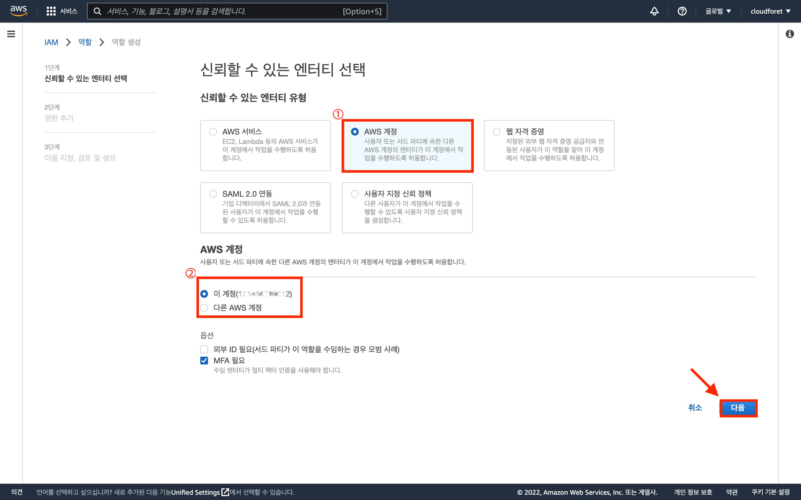

(4) 추가할 권한 정책을 클릭한 후 [다음] 버튼을 클릭합니다.

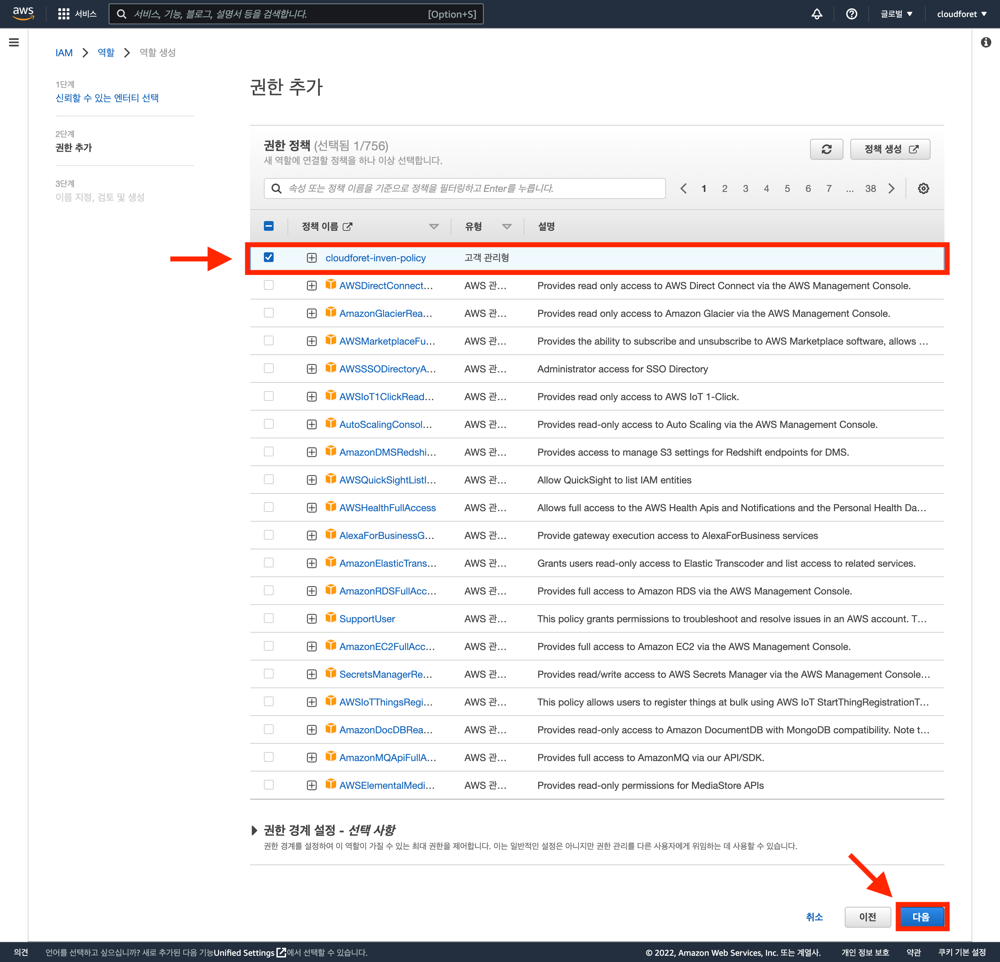

(5) 역할 이름을 입력 후 [역할 생성] 버튼을 클릭합니다.

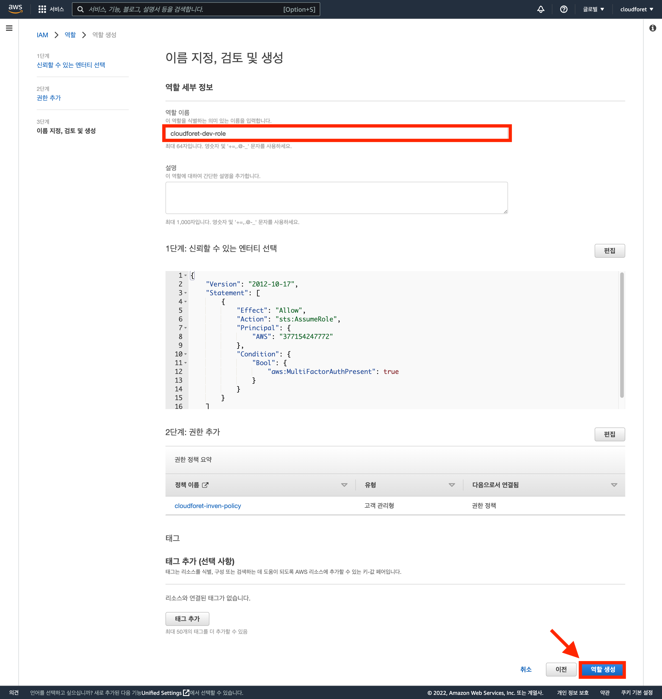

(6) [대시보드> 역할 > 역할 이름] 메뉴 이동 시 **[aws_assume_role]** 에 필요한 설정 정보인 **[Role ARN]** 값을 확인할 수 있습니다.

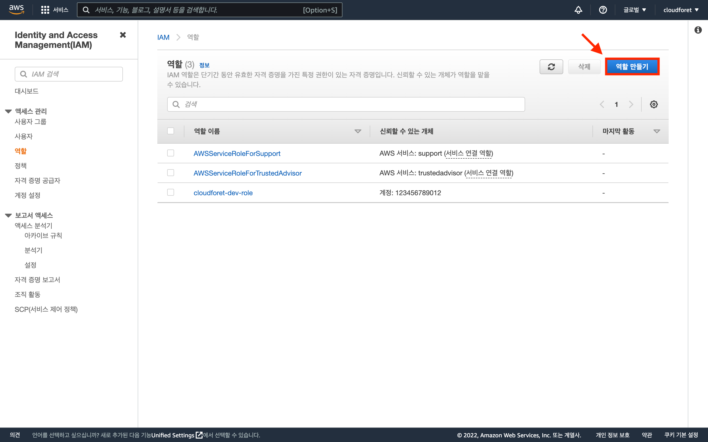

 
 

## 5. 서비스 계정 등록

이제 서비스 계정 추가를 위한 준비가 끝났습니다.  
지금까지 설정 가이드를 진행하면서 얻은 설정 정보를 활용해 서비스 계정을 등록할 수 있습니다.   
서비스 계정 등록의 자세한 방법은 **[[클라우드포레 사용자 가이드]](https://spaceone.org/ko/docs/guides/asset-inventory/service-account/#%EC%84%9C%EB%B9%84%EC%8A%A4-%EA%B3%84%EC%A0%95-%EC%B6%94%EA%B0%80%ED%95%98%EA%B8%B0)** 를 참고하십시오.

- **Account ID**
- **AWS Access Key ID**
- **AWS Secret Key**
- **Role ARN(선택)**

(1) Account ID는 AWS의 Account ID 정보입니다.

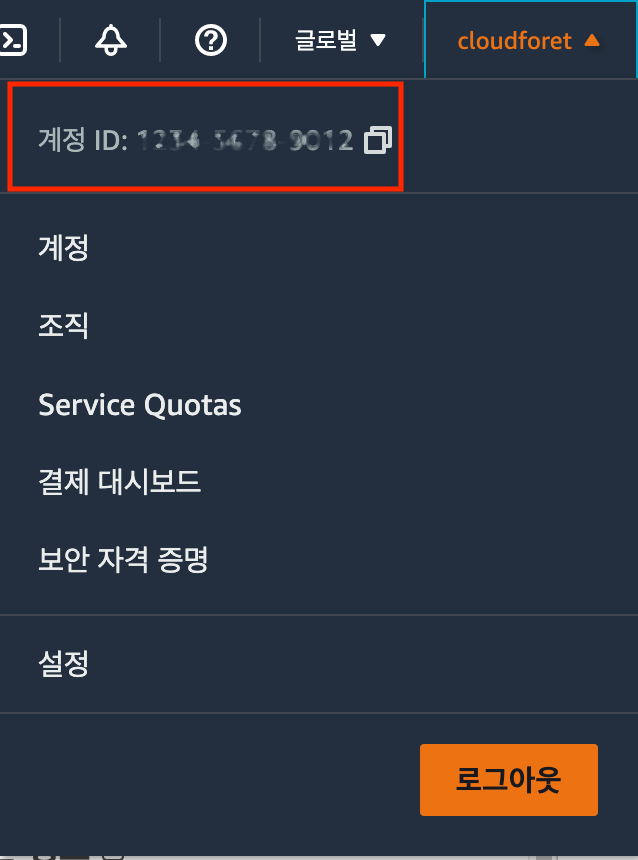

(1-1) 서비스 계정 추가 시 Account ID 필드에 AWS의 Account ID 정보를 입력해 주십시오.

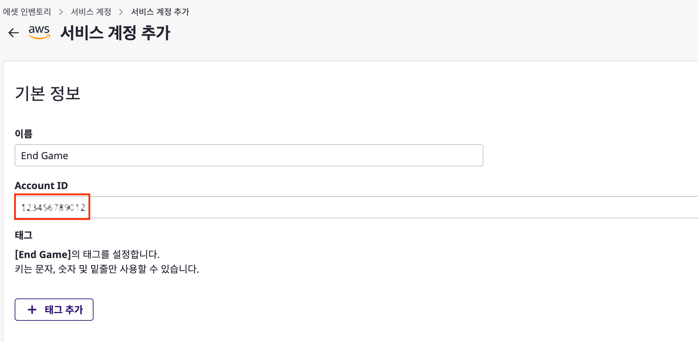

(2) AWS 암호화키 방식에 따라 **[aws_aceess_key]** 또는 **[aws_assume_role]** 을 선택합니다.  
두 가지 방식 모두 **[AWS Access Key ID]** 와 **[AWS Secret Acess Key]** 설정 정보가 필요합니다.

(2-1) **[aws_aceess_key]** 방식 예시입니다.

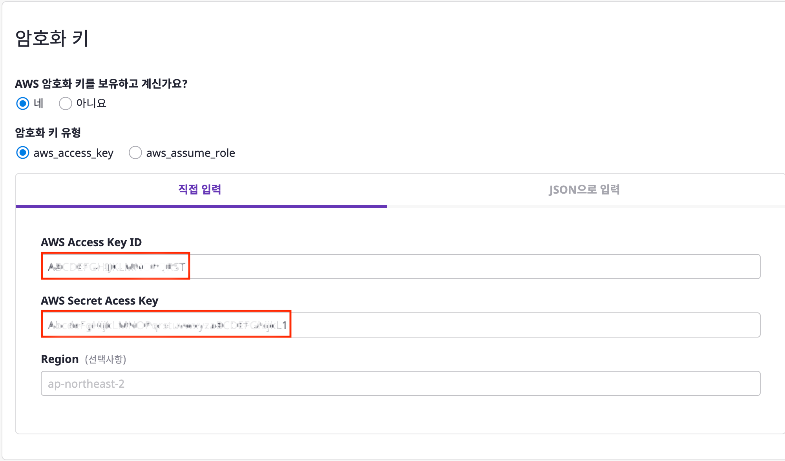

(2-2) **[aws_asuume_role]** 방식 예시입니다. 
추가적으로 **[Role ARN]** 설정 정보가 필요합니다.

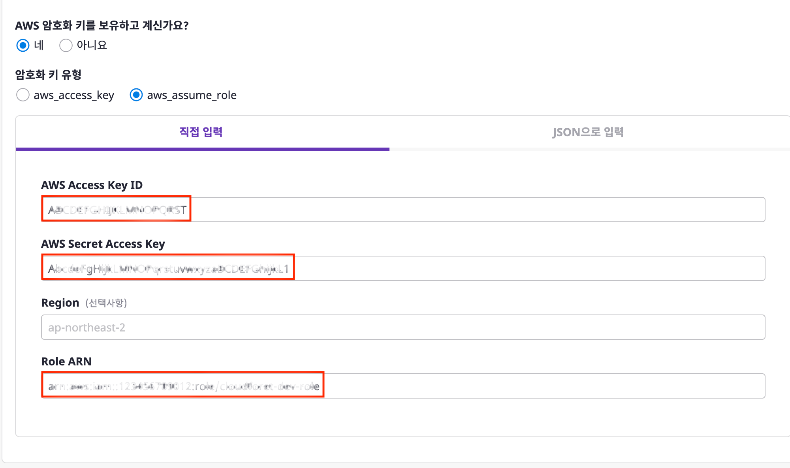

(2-3) [저장] 버튼을 클릭합니다.

(3) 이후 클라우드포레의 **컬렉터 플러그인** 생성 방법은 [[클라우드포레의 사용자 가이드]](https://spaceone.org/ko/docs/guides/asset-inventory/collector/)를 참고하십시오.